# **AFP UGC Platform - Data Flow Diagram**

## **High-Level System Context**

```mermaid
graph TB
    %% External Systems
    subgraph "External Systems"
        USER[👤 Content Creator/Admin]
        AMAZON[(Amazon/E-commerce Sites)]
        OPENAI[🤖 OpenAI API]
        KIEAI[🎬 Kie.ai API]
        LEMON[💳 Lemon Squeezy]
        CRYPTO[₿ Cryptomus]
        TIKTOK[📱 TikTok API]
        YOUTUBE[📺 YouTube API]
        INSTAGRAM[📸 Instagram API]
    end

    %% Core Platform
    subgraph "AFP UGC Platform (Next.js + Vercel)"
        subgraph "Frontend (React/Next.js)"
            UI[🎨 User Interface<br/>Wizard, Dashboard, Library]
            AUTH[🔐 Authentication<br/>Login/Signup]
        end

        subgraph "API Layer (Next.js Routes)"
            API_AUTH[🔐 Auth API<br/>OAuth, Sessions]
            API_GENERATE[🎬 Generate API<br/>Script/Video]
            API_BATCH[📦 Batch API<br/>Bulk Processing]
            API_SOCIAL[📱 Social API<br/>Publish/Share]
            API_PAYMENT[💰 Payment API<br/>Checkout/Webhooks]
            API_ADMIN[⚙️ Admin API<br/>Management/Monitoring]
        end

        subgraph "Business Logic"
            CREDIT_MGR[💳 Credit Manager<br/>Balance Tracking]
            SCRAPER[🕷️ Content Scraper<br/>Amazon Data]
            SCRIPT_GEN[✍️ Script Generator<br/>OpenAI Integration]
            VIDEO_ORCH[🎭 Video Orchestrator<br/>Kie.ai Integration]
            QUALITY_ANAL[🔍 Quality Analysis<br/>Risk Assessment]
            SOCIAL_INTEG[🌐 Social Integration<br/>OAuth/Posting]
        end

        subgraph "Database (Supabase)"
            DB[(📊 PostgreSQL)]
        end

        subgraph "Storage (Supabase)"
            STORAGE[(💾 File Storage<br/>Videos/Images)]
        end
    end

    %% Data Flow Connections
    USER --> UI
    UI --> AUTH
    AUTH --> DB
    UI --> API_AUTH
    API_AUTH --> DB

    UI --> API_GENERATE
    API_GENERATE --> SCRAPER
    SCRAPER --> AMAZON
    API_GENERATE --> SCRIPT_GEN
    SCRIPT_GEN --> OPENAI
    API_GENERATE --> VIDEO_ORCH
    VIDEO_ORCH --> KIEAI
    API_GENERATE --> DB
    API_GENERATE --> STORAGE

    UI --> API_BATCH
    API_BATCH --> API_GENERATE

    UI --> API_SOCIAL
    API_SOCIAL --> SOCIAL_INTEG
    SOCIAL_INTEG --> TIKTOK
    SOCIAL_INTEG --> YOUTUBE
    SOCIAL_INTEG --> INSTAGRAM
    API_SOCIAL --> DB

    UI --> API_PAYMENT
    API_PAYMENT --> LEMON
    API_PAYMENT --> CRYPTO
    API_PAYMENT --> DB

    UI --> API_ADMIN
    API_ADMIN --> DB
    API_ADMIN --> STORAGE

    CREDIT_MGR --> DB
    QUALITY_ANAL --> DB

    DB --> STORAGE
```

## **Detailed Data Flows**

### **1. User Authentication & Onboarding Flow**

### **2. Video Generation Flow (Wizard)**

### **3. Payment & Credit System Flow**

### **4. Batch Processing Flow**

### **5. Social Media Integration Flow**

## **Database Schema Overview**

## **Key Data Transformation Points**

### **Credit Management**
- **Input**: Payment webhooks, video generation requests
- **Processing**: Atomic transactions with database triggers
- **Output**: Updated user balances, transaction history

### **Quality Assessment**
- **Input**: User prompts, image URLs, content metadata
- **Processing**: Risk analysis algorithms, tier-based model selection
- **Output**: Model recommendations, enhanced prompts, quality scores

### **Video Generation Pipeline**
- **Input**: Product URLs, user scripts, image selections
- **Processing**: Scraping → AI script generation → Video rendering → Storage
- **Output**: MP4 videos, metadata, performance analytics

### **Batch Processing**
- **Input**: CSV files with product URLs
- **Processing**: Parallel video generation with credit reservation
- **Output**: Multiple videos, batch statistics, failure handling

### **Social Publishing**
- **Input**: Completed videos, user captions, platform selections
- **Processing**: OAuth token management, platform-specific APIs
- **Output**: Published posts, engagement tracking

## **Data Security & Privacy**

- **Row Level Security (RLS)**: Users can only access their own data
- **Encrypted Tokens**: OAuth tokens stored encrypted in database
- **Webhook Verification**: Payment webhooks verified with HMAC signatures
- **Input Validation**: All API inputs validated with Zod schemas
- **Credit Protection**: Atomic transactions prevent overdrafts

## **Performance & Scalability Considerations**

- **Serverless Architecture**: Vercel handles scaling automatically
- **Database Indexing**: Optimized queries for common access patterns
- **Polling Optimization**: Client-side polling for async operations
- **Circuit Breakers**: API failure protection for external services
- **Storage Optimization**: Supabase Storage with CDN delivery

---

*This diagram represents the complete data architecture of the AFP UGC platform as of December 2025. The system handles complex workflows involving AI-powered video generation, multi-provider payments, social media integration, and batch processing while maintaining data integrity and user privacy.*
