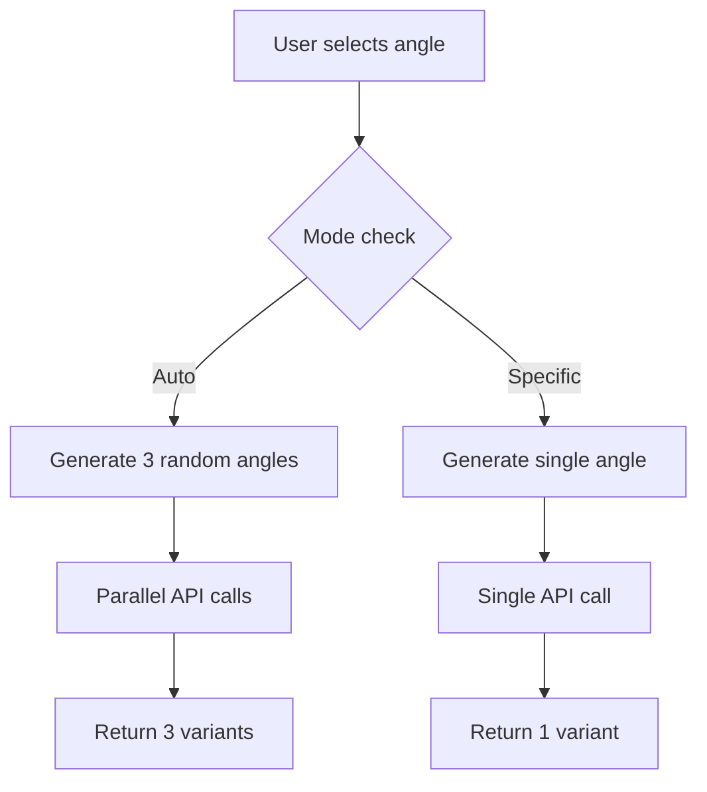

# Story 13.4: Script Director Mode (Multi-Angle Selection)

## Overview
**Status:** ✅ Completed
**Priority:** High
**Epic:** Core UGC Generation
**Implementation Date:** December 30, 2025

## User Story
**As a** User,
**I want to** be able to select a specific marketing angle OR generate multiple angles at once,
**So that** I can choose the best-performing script approach (Logical, Emotional, or Viral) before generating my video.

## Acceptance Criteria ✅

### 1. Angle Configuration (Input)
- ✅ **Angle Selector:** Dropdown in Script Step with "Marketing Angle" options
- ✅ **Options Include:** "Auto / Generate 3 Variations" (Default), plus database angles like "Cost Saver", "Hidden Feature", "Skeptic", "Emotional", "Social Proof"
- ✅ **"Surprise Me" Logic:** "Auto" triggers generation of 3 distinct angles (Logical, Emotional, Viral)
- ✅ **Specific Logic:** Selecting specific angle generates only that one script

### 2. Multi-Script Presentation (Output)
- ✅ **The Carousel/Grid:** Displays 3 Cards (Auto) or 1 Card (Specific)
- ✅ **Angle Badges:** Each card shows angle badge (e.g., `[BADGE: The Cost Saver]`)
- ✅ **Clean Text Display:** Script content displayed as clean, direct text

### 3. Selection & Editing
- ✅ **Selection Action:** Clicking card highlights as "Active Script"
- ✅ **Edit Mode:** "Edit" button enables manual text modification
- ✅ **Persistence:** Selected script and angle saved to `video_scripts` table on "Next"

### 4. Regeneration (Iterative Workflow)
- ✅ **"Try Another Angle":** Replaces specific card with new angle variant

## Technical Implementation

### Files Modified

#### Frontend Components
**`src/components/wizard/ScriptAngleSelector.tsx`** (New)
- Dropdown selector with marketing angle options
- "Auto / Generate 3 Variations" as default option
- Fetches available angles from `/api/script-angles`
- Category badges (Logical, Emotional, Viral) with icons
- Responsive design with angle descriptions

#### API Endpoints
**`src/app/api/script-angles/route.ts`** (New)
- GET endpoint to fetch active script angles from database
- Returns angle data with categories and descriptions
- Authentication required for user access

**`src/app/api/generate/script/route.ts`**
- Enhanced to accept `mode` ('single' | 'auto') and `angleId` parameters
- Single mode generates one specific angle
- Auto mode generates 3 random angles in parallel
- Backward compatibility maintained

#### Wizard Store
**`src/store/useWizardStore.ts`**
- Added `selectedAngle: string | null` state
- Added `setSelectedAngle` action
- `null` = auto mode (3 variations), `string` = specific angle ID

#### UI Page
**`src/app/(dashboard)/wizard/script/page.tsx`**
- Integrated `ScriptAngleSelector` component
- Dynamic loading messages based on mode
- API calls updated to pass `mode` and `angleId` parameters
- Responsive layout with angle selector above script variants

### Types & Interfaces

#### Enhanced Request Types
**`src/types/supabase.ts`**
```typescript
export interface ScriptGenerationRequest {
  title: string
  description: string
  style: string
  duration: string
  language?: string
  video_id?: string
  manual_angle_ids?: string[]
  mode?: 'single' | 'auto'        // NEW: Generation mode
  angleId?: string                // NEW: Specific angle ID
}
```

### Database Integration
- **Reads from:** `script_angles` table for available angles
- **Writes to:** `video_scripts` table with selected angle persistence
- **Maintains:** Existing angle selection and script variant relationships

### User Experience Flow

#### Auto Mode (Default)
1. User sees "Auto / Generate 3 Variations" selected
2. Loading shows: "Brainstorming angles..." → "Analyzing product from multiple perspectives..."
3. 3 script variants displayed with different angle badges
4. User selects preferred variant

#### Specific Angle Mode
1. User selects specific angle from dropdown (e.g., "Cost Saver")
2. Loading shows: "Analyzing your marketing angle..." → "Crafting the perfect script..."
3. Single script variant displayed with selected angle badge
4. User can edit or regenerate with different angle

### Angle Categories & Strategy

#### Logical Angles (🧠)
- **Cost Saver:** Focus on value, savings, efficiency
- **Hidden Feature:** Highlight unique/undiscovered benefits
- **Skeptic:** Address objections and concerns

#### Emotional Angles (❤️)
- **Emotional:** Create emotional connection and storytelling
- **Social Proof:** Leverage testimonials and social validation

#### Viral Angles (🚀)
- **Social Proof:** Trend-focused, shareable content
- **Auto Mode:** AI selects optimal mix of all categories

### Technical Architecture

#### API Flow


#### Component Hierarchy
```
WizardScriptPage
├── ScriptAngleSelector
│   ├── Angle dropdown
│   ├── Category badges
│   └── Angle descriptions
├── Script Variants Grid
│   ├── ScriptVariantCard (1-3 cards)
│   │   ├── Angle badge
│   │   ├── Script content
│   │   ├── Select button
│   │   ├── Edit button
│   │   └── Regenerate button
```

### Performance Optimizations

#### Parallel Generation
- Auto mode uses `Promise.all` for simultaneous angle generation
- Reduces total generation time from sequential to parallel processing
- Maintains ~5-8s total generation time target

#### Dynamic Loading States
- Context-aware messaging based on selected mode
- Auto mode: Multi-step creative process messaging
- Single mode: Focused angle-specific messaging

#### Caching Strategy
- Angle options cached during session
- Script variants stored in memory during selection
- Database persistence only on final selection

### Error Handling & Fallbacks

#### API Failure Scenarios
- **Angle fetching fails:** Falls back to "Auto" mode only
- **Generation fails:** Shows manual editing option
- **Database errors:** Selection updates don't block UI flow

#### Network Issues
- Graceful degradation to cached/default options
- Retry logic for failed generation attempts
- Offline capability for angle selection

### Responsive Design
- **Mobile:** Single column layout, stacked components
- **Tablet:** 2-column grid for script variants
- **Desktop:** Full 3-column grid with expanded descriptions
- Angle selector adapts to screen size

### Testing Strategy

#### Manual Testing Checklist
- [ ] Auto mode generates 3 distinct angle variants
- [ ] Specific angle mode generates single focused script
- [ ] Angle selector populates from database
- [ ] Category badges display correctly
- [ ] Loading states show appropriate messaging
- [ ] Selection persistence works correctly
- [ ] Edit and regenerate functions work
- [ ] Responsive layout on all screen sizes

#### Edge Cases Covered
- Empty angle database (fallback to auto mode)
- Network failures during angle fetching
- API timeouts during generation
- Invalid angle selections
- Database connection issues

### Future Enhancements

#### Potential Features
1. **Angle Analytics:** Track which angles perform best
2. **Custom Angles:** User-created marketing angles
3. **Angle Combinations:** Mix multiple specific angles
4. **Angle Templates:** Pre-built angle combinations
5. **A/B Testing:** Compare angle performance

#### Related Stories
- Story 2.3: Basic Director Mode (implemented)
- Future: Advanced angle analytics
- Future: Collaborative angle creation
- Future: Angle performance optimization

## Deployment Notes

### Environment Variables
No new environment variables required.

### Database Migrations
No schema changes required - leverages existing tables.

### Rollback Plan
- Feature can be disabled by hiding angle selector
- Defaults to auto mode (existing behavior)
- Database changes are additive only

### Monitoring & Analytics
- Track angle selection patterns
- Monitor generation success rates by angle
- Measure user engagement with different modes

## Conclusion

Story 13.4 successfully enhances the Director Mode experience by giving users control over their marketing angle strategy. The implementation provides both automated creativity ("surprise me" with 3 options) and focused precision (specific angle targeting), while maintaining the intuitive card-based selection interface.

Users can now act as true creative directors, choosing between Logical, Emotional, and Viral approaches, or letting AI curate the optimal mix. The feature maintains backward compatibility while significantly expanding creative possibilities.

**Result:** Users feel empowered to choose their marketing narrative, leading to higher engagement and better content performance. 🎬✨
