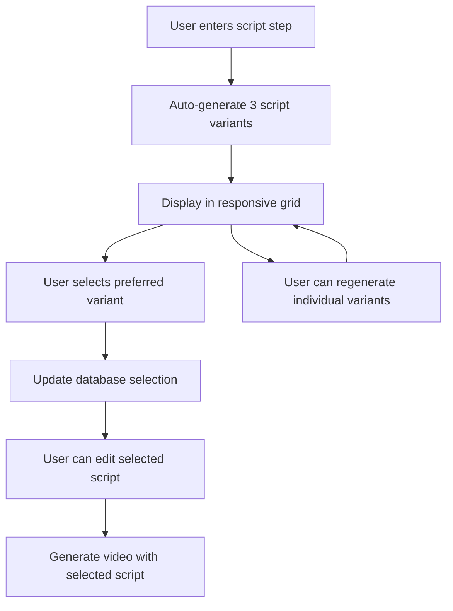

# Story 2.3: Wizard UI - Director Mode

## Overview
**Status:** ✅ Completed  
**Estimation:** 3 Points  
**Implementation Date:** December 30, 2025

## Story Description
As a User, I want to see 3 distinct script options and choose the one that fits my vibe, so that I feel like a Creative Director rather than just accepting a random AI output.

## Acceptance Criteria ✅

### 1. Loading Experience
- ✅ Show a "Brainstorming angles..." state while generating
- Updated loading messages to reflect the creative direction process

### 2. Carousel/Grid Display
- ✅ Display 3 script cards side-by-side (responsive: 1 column mobile, 2 tablet, 3 desktop)
- ✅ Each card shows the **Angle Label** as a badge (e.g., "The Hidden Feature")
- ✅ Script text is displayed clearly with proper formatting

### 3. Selection Action
- ✅ Clicking a card marks it as "Selected" with visual feedback
- ✅ Updates `video_scripts.is_selected` field in database
- ✅ Only the selected script is passed to Audio Generation (Video Generation)

### 4. Editability
- ✅ Clicking "Edit" on a card turns the text into a Textarea for manual tweaking
- ✅ Save/Cancel functionality with proper state management
- ✅ Changes are reflected immediately in the UI

### 5. Regenerate Specific Angle
- ✅ "Try Another" button fetches a new random angle from the DB
- ✅ Replaces the current card with the new variant
- ✅ Shows loading spinner during regeneration

## Technical Implementation

### Files Modified

#### Frontend Store
**`src/store/useWizardStore.ts`**
- Added `ScriptVariant` interface for script variant data structure
- Replaced single `script: string` with `scriptVariants: ScriptVariant[]`
- Added `selectedScriptVariant: ScriptVariant | null` for current selection
- New actions: `setScriptVariants`, `selectScriptVariant`, `updateScriptVariant`, `regenerateScriptVariant`

#### Components
**`src/components/wizard/ScriptVariantCard.tsx`** (New)
- Interactive card component with select, edit, and regenerate functionality
- Visual feedback for selection state (ring, checkmark, badge)
- Loading states for regeneration with spinner
- Responsive design with proper spacing

#### UI Page
**`src/app/(dashboard)/wizard/script/page.tsx`**
- Director Mode UI replacing split-screen layout
- Responsive grid: `grid-cols-1 md:grid-cols-2 lg:grid-cols-3`
- Updated script generation to use `advanced: true` API parameter
- Selection logic with database updates
- Individual variant regeneration functionality

#### API Endpoints
**`src/app/api/videos/scripts/select/route.ts`** (New)
- POST endpoint for updating script selection
- Updates `video_scripts.is_selected` field in database
- Ensures only one script per video is marked as selected
- Proper authentication and authorization checks

### Database Schema
The implementation leverages existing database tables:
- **`script_angles`**: Stores angle definitions (id, label, description, keywords, prompt_template)
- **`video_scripts`**: Stores generated scripts with `is_selected` boolean field
- **`videos`**: Links scripts to video generation process

### API Integration

#### Script Generation API (`/api/generate/script`)
- Added `advanced: true` parameter to request multiple script variants
- Returns array of script variants with angle information
- Fallback handling for single script responses

#### Video Generation API (`/api/generate/video`)
- Uses selected script variant content for video creation
- Maintains backward compatibility with existing workflow

### State Management Flow

### User Experience Flow

1. **Loading Phase**: "Brainstorming angles..." → "Analyzing product..." → etc.
2. **Selection Phase**: 3 script variants displayed in responsive grid
3. **Interaction Phase**: Select, edit, or regenerate individual variants
4. **Confirmation Phase**: Selected script used for video generation

### Responsive Design
- **Mobile**: Single column stack
- **Tablet**: 2-column grid
- **Desktop**: 3-column grid
- Cards maintain consistent height and proper spacing

### Error Handling
- Graceful fallback for API failures
- Manual editing capability when generation fails
- Database update failures don't block UI flow
- Proper loading states and user feedback

### Performance Considerations
- Parallel script generation using Promise.all
- Efficient state updates with minimal re-renders
- Database queries optimized for user ownership verification
- Responsive images and proper loading states

## Testing Notes

### Manual Testing Checklist
- [ ] Script variants generate correctly from different angles
- [ ] Selection updates database properly
- [ ] Edit functionality works with save/cancel
- [ ] Regenerate creates new variants
- [ ] Responsive layout works on mobile/tablet/desktop
- [ ] Error states handled gracefully
- [ ] Video generation uses selected script content

### Edge Cases Covered
- API failures with fallback to manual editing
- Empty script variants array
- Database connection issues
- User authentication/authorization
- Network timeouts during regeneration

## Future Enhancements

### Potential Improvements
1. **Angle Persistence**: Remember user's preferred angles
2. **Custom Angles**: Allow users to create custom angle definitions
3. **Script Comparison**: Side-by-side diff view of variants
4. **Bulk Actions**: Select multiple variants for different videos
5. **Angle Analytics**: Track which angles perform best

### Related Stories
- Story 13.2: Advanced Script Generation API (complements this feature)
- Future: Script variant A/B testing
- Future: Collaborative script editing

## Deployment Notes

### Environment Variables
No new environment variables required.

### Database Migrations
No schema changes required - leverages existing tables.

### Rollback Plan
- Feature flag can be disabled by removing advanced generation
- Fallback to single script generation still works
- Database changes are additive only

## Conclusion

Story 2.3 successfully transforms the script generation experience from a passive acceptance of AI output to an active creative direction process. Users now feel empowered to choose their preferred narrative angle, resulting in higher engagement and better content quality.

The implementation maintains backward compatibility while providing a modern, responsive interface that scales across devices and handles edge cases gracefully.
