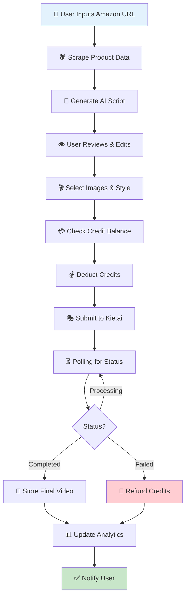
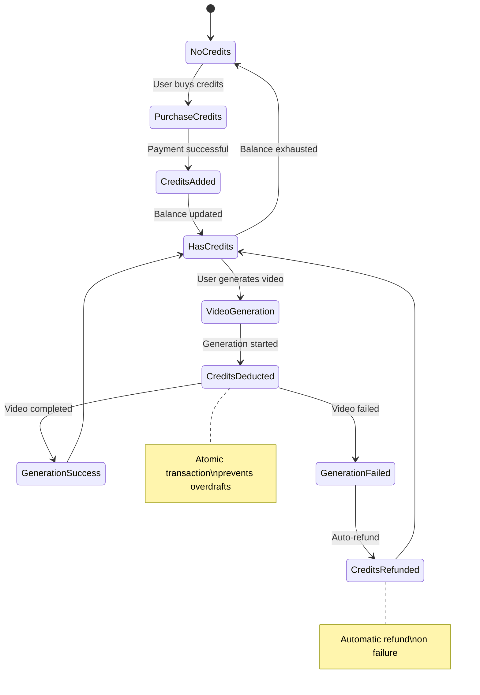
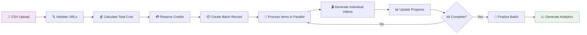
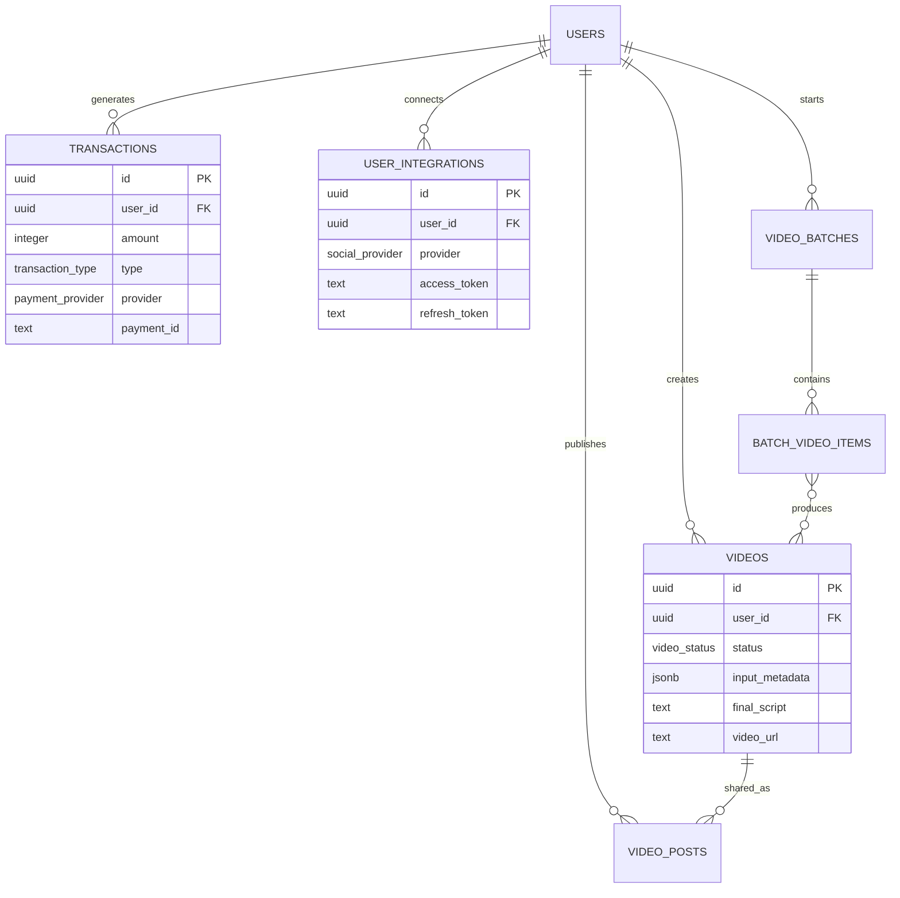
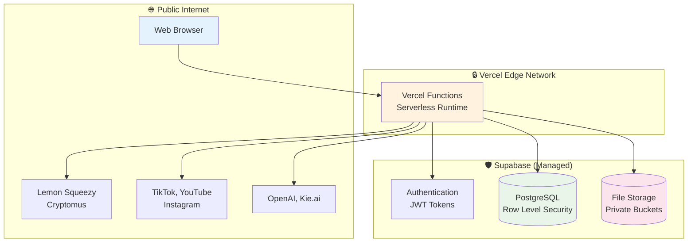
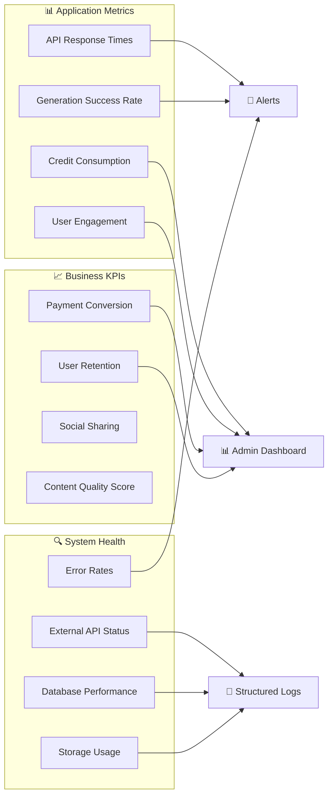

# **AFP UGC Platform - Visual Data Flow Diagram**

## **Complete System Architecture**

```mermaid
graph TB
    %% Define styles
    classDef external fill:#e1f5fe,stroke:#01579b,stroke-width:2px
    classDef frontend fill:#f3e5f5,stroke:#4a148c,stroke-width:2px
    classDef api fill:#fff3e0,stroke:#e65100,stroke-width:2px
    classDef business fill:#e8f5e8,stroke:#1b5e20,stroke-width:2px
    classDef database fill:#fff8e1,stroke:#f57f17,stroke-width:2px
    classDef storage fill:#fce4ec,stroke:#880e4f,stroke-width:2px

    %% External Systems
    USER[👤 Content Creator]:::external
    ADMIN[👑 Platform Admin]:::external
    AMAZON[(🛒 Amazon/E-commerce)]:::external
    OPENAI[🤖 OpenAI API]:::external
    KIEAI[🎬 Kie.ai API]:::external
    LEMON[💳 Lemon Squeezy]:::external
    CRYPTO[₿ Cryptomus]:::external
    TIKTOK[📱 TikTok]:::external
    YOUTUBE[📺 YouTube]:::external
    INSTAGRAM[📸 Instagram]:::external

    %% Frontend Layer
    subgraph "🎨 Frontend (Next.js)"
        UI_WIZARD[Wizard Interface<br/>URL Input → Script → Video]:::frontend
        UI_DASHBOARD[Dashboard<br/>Library & Management]:::frontend
        UI_ADMIN[Admin Panel<br/>User & Content Moderation]:::frontend
        UI_BILLING[Billing & Credits]:::frontend
        UI_SOCIAL[Social Integration]:::frontend
    end

    %% API Layer
    subgraph "⚡ API Routes (Serverless)"
        API_AUTH[🔐 Auth API<br/>/auth/*]:::api
        API_GENERATE[🎬 Generate API<br/>/generate/*]:::api
        API_BATCH[📦 Batch API<br/>/bulk/*]:::api
        API_SOCIAL[📱 Social API<br/>/social/*]:::api
        API_PAYMENT[💰 Payment API<br/>/payment/*]:::api
        API_ADMIN[⚙️ Admin API<br/>/admin/*]:::api
        WEBHOOKS[📨 Webhooks<br/>/webhooks/*]:::api
    end

    %% Business Logic Layer
    subgraph "🧠 Business Logic"
        AUTH_MGR[Authentication<br/>Supabase Auth]:::business
        CREDIT_MGR[💳 Credit Manager<br/>Balance & Transactions]:::business
        SCRAPER[🕷️ Content Scraper<br/>Amazon Data Extraction]:::business
        SCRIPT_GEN[✍️ Script Generator<br/>OpenAI Integration]:::business
        VIDEO_ORCH[🎭 Video Orchestrator<br/>Kie.ai Integration]:::business
        QUALITY_ANAL[🔍 Quality Analysis<br/>Risk Assessment]:::business
        SOCIAL_INTEG[🌐 Social Integration<br/>OAuth & Publishing]:::business
        BATCH_PROC[📊 Batch Processor<br/>Bulk Operations]:::business
    end

    %% Data Layer
    subgraph "💾 Data Storage (Supabase)"
        DB_USERS[(👥 Users<br/>Profiles & Auth)]:::database
        DB_VIDEOS[(🎬 Videos<br/>Generation Records)]:::database
        DB_TRANSACTIONS[(💰 Transactions<br/>Credits & Payments)]:::database
        DB_BATCHES[(📦 Batches<br/>Bulk Processing)]:::database
        DB_INTEGRATIONS[(🔗 Integrations<br/>Social OAuth)]:::database
        DB_POSTS[(📱 Posts<br/>Social Publishing)]:::database
        DB_ANALYTICS[(📊 Analytics<br/>Usage Metrics)]:::database
    end

    %% Storage Layer
    subgraph "🗄️ File Storage"
        VIDEO_STORAGE[(🎥 Video Files<br/>MP4, WebM)]:::storage
        IMAGE_STORAGE[(🖼️ Images<br/>Product Photos)]:::storage
        TEMP_STORAGE[(📁 Temporary<br/>Processing Files)]:::storage
    end

    %% Main User Flow
    USER --> UI_WIZARD
    UI_WIZARD --> API_GENERATE
    API_GENERATE --> SCRAPER
    SCRAPER --> AMAZON
    API_GENERATE --> SCRIPT_GEN
    SCRIPT_GEN --> OPENAI
    API_GENERATE --> VIDEO_ORCH
    VIDEO_ORCH --> KIEAI

    %% Credit & Payment Flow
    USER --> UI_BILLING
    UI_BILLING --> API_PAYMENT
    API_PAYMENT --> LEMON
    API_PAYMENT --> CRYPTO
    LEMON --> WEBHOOKS
    CRYPTO --> WEBHOOKS
    WEBHOOKS --> CREDIT_MGR

    %% Social Integration Flow
    USER --> UI_SOCIAL
    UI_SOCIAL --> API_SOCIAL
    API_SOCIAL --> SOCIAL_INTEG
    SOCIAL_INTEG --> TIKTOK
    SOCIAL_INTEG --> YOUTUBE
    SOCIAL_INTEG --> INSTAGRAM

    %% Batch Processing Flow
    USER --> UI_DASHBOARD
    UI_DASHBOARD --> API_BATCH
    API_BATCH --> BATCH_PROC
    BATCH_PROC --> API_GENERATE

    %% Admin Flow
    ADMIN --> UI_ADMIN
    UI_ADMIN --> API_ADMIN

    %% Authentication Flow
    USER --> API_AUTH
    ADMIN --> API_AUTH
    API_AUTH --> AUTH_MGR

    %% Database Connections
    AUTH_MGR --> DB_USERS
    CREDIT_MGR --> DB_TRANSACTIONS
    VIDEO_ORCH --> DB_VIDEOS
    BATCH_PROC --> DB_BATCHES
    SOCIAL_INTEG --> DB_INTEGRATIONS
    SOCIAL_INTEG --> DB_POSTS
    QUALITY_ANAL --> DB_ANALYTICS

    %% Storage Connections
    VIDEO_ORCH --> VIDEO_STORAGE
    SCRAPER --> IMAGE_STORAGE
    BATCH_PROC --> TEMP_STORAGE

    %% Cross-connections
    API_GENERATE --> CREDIT_MGR
    API_BATCH --> CREDIT_MGR
    API_GENERATE --> QUALITY_ANAL
    API_BATCH --> QUALITY_ANAL
```

## **Core Video Generation Workflow**

## **Credit Management System**

## **Batch Processing Architecture**

## **Data Entity Relationships**

## **System Boundaries & Security**

## **Performance & Monitoring**

---

## **Legend**

| Icon | Meaning |
|------|---------|
| 👤 | User/Actor |
| 🎨 | Frontend/UI |
| ⚡ | API/Serverless |
| 🧠 | Business Logic |
| 💾 | Database |
| 🗄️ | File Storage |
| 🔒 | Security Boundary |
| 💳 | Payment/Credits |
| 🎬 | Video Processing |
| 📱 | Social Media |
| 🤖 | AI Services |
| 📊 | Analytics/Monitoring |

*This visual data flow diagram provides a comprehensive overview of the AFP UGC platform's architecture, showing how data flows through the system from user input to final video output, including all major components, external integrations, and security boundaries.*
